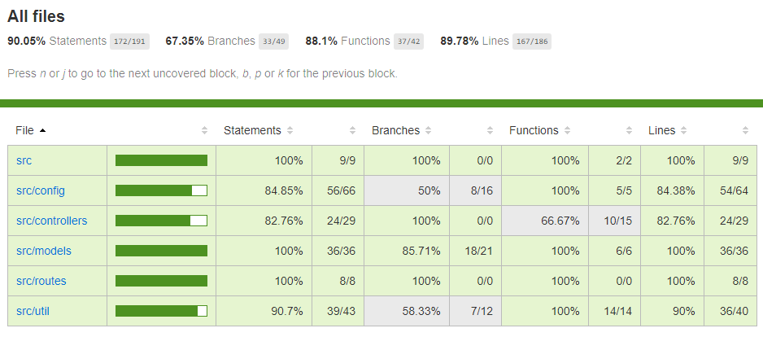

# Client Management REST API 

## Overview

Client management backend implemented with Node.js + Express following [Airbnb's Javascript style guide](https://github.com/airbnb/javascript).

### Features

| Feature                                | Summary                                                                                                                                                                                                                                                     |
|----------------------------------------|-------------------------------------------------------------------------------------------------------------------------------------------------------------------------------------------------------------------------------------------------------------|
| ES6 via Babel                  	 	     | ES6 support using [Babel](https://babeljs.io/).  |
| Code Linting               			       | JavaScript code linting is done using [ESLint](http://eslint.org) - a pluggable linter tool for identifying and reporting on patterns in JavaScript. Uses ESLint with [eslint-config-airbnb](https://github.com/airbnb/javascript/tree/master/packages/eslint-config-airbnb), which tries to follow the Airbnb JavaScript style guide.                                                                                                |
| Auto server restart                  	 | Restart the server using [nodemon](https://github.com/remy/nodemon) in real-time anytime an edit is made, with babel compilation and eslint.                                                                                                                                                                            |
| Unit & Integration testing            | [Jest](https://www.npmjs.com/package/jest) + [Supertest](https://www.npmjs.com/package/supertest) + [chai](http://www.chaijs.com/). To be executed with `npm test`. |
| ES6 Code Coverage                  | Supports code coverage of ES6 code using jest. Code coverage reports are saved in `coverage/` directory post `npm run test:coverage` execution. Open `coverage/lcov-report/index.html` to view coverage report.                                                                                                                                                                            |
| API parameter validation via [express-validation](https://www.npmjs.com/package/express-validation)           | Validate body, params, query, headers and cookies of a request (via middleware) and return a response with errors; if any of the configured validation rules fail. You won't anymore need to make your route handler dirty with such validations. |
| Logging with Winston                 | [Winston](https://www.npmjs.com/package/winston) is designed to be a simple and universal logging library with support for multiple transports. |
| HTTP Logging with [Morgan](https://www.npmjs.com/package/morgan)             | HTTP request logger middleware for node.js |
| Environment configuraton | [Dotenv](https://www.npmjs.com/package/dotenv) is a zero-dependency module that loads environment variables from a .env file into process.env |


## Getting Started

##### Install dependencies
```sh
npm install
```

##### Set environment (optional)
Modify the `.env` to configure the environment parameters (target environment, listening port, etc)


#####  Start server
```sh
node src/app.js
```
Refer [debug](https://www.npmjs.com/package/debug) to know how to selectively turn on logs.


##### Tests
```sh
# Run unit & integration tests written in ES6 
npm test

# Run test along with code coverage
npm run test:coverage
```

##### Lint
```sh
# Lint code with ESLint
npm run lint
```

## Logging
Universal logging library [winston](https://www.npmjs.com/package/winston) is used for logging. It has support for multiple transports.  A transport is essentially a storage device for your logs. Each instance of a winston logger can have multiple transports configured at different levels. For example, one may want error logs to be stored in a persistent remote location (like a database), but all logs output to the console or a local file. We just log to the console for simplicity, you can configure more transports as per your requirement.

#### API logging
Logs detailed info about each api request to console during development.
```sh
{
  "res": {
    "statusCode": 200,
    "body": {
      "id": 1,
      "name": "Leanne Graham",
      "username": "Bret",
      "email": "Sincere@april.biz",
      "phone": "1-770-736-8031 x56442",
      "website": "hildegard.org",
      "address": {
        "street": "Kulas Light",
        "suite": "Apt. 556",
        "city": "Gwenborough",
        "zipcode": "92998-3874",
        "geo": {
          "lat": "-37.3159",
          "lng": "81.1496"
        }
      },
      "company": {
        "name": "Romaguera-Crona",
        "catchPhrase": "Multi-layered client-server neural-net",
        "bs": "harness real-time e-markets"
      }
    }
  },
  "req": {
    "url": "/api/v1/client/1",
    "headers": {
      "cache-control": "no-cache",
      "postman-token": "859d21cd-061e-426c-aa8c-f641b2cc933b",
      "user-agent": "PostmanRuntime/7.1.1",
      "accept": "*/*",
      "host": "localhost:4040",
      "accept-encoding": "gzip, deflate",
      "connection": "keep-alive"
    },
    "method": "GET",
    "httpVersion": "1.1",
    "originalUrl": "/api/v1/client/1",
    "query": {}
  },
  "responseTime": 2,
  "level": "info",
  "message": "HTTP GET /api/v1/client/1 200 2ms"
}
GET /api/v1/client/1 200 2.053 ms - 401

```
## Error handling
A global error handler has been configured at `express.js` and its the responsable of transforming any error to a structured json  
```json
{
    "message": "Validation error",
    "details": [
        [
            "\"username\" is required"
        ]
    ],
    "stack": "APIError: Validation error at new ExtendableError ..."
}
```


## Code Coverage
Get code coverage summary on executing `npm run test:coverage`. This creates a report stored at `coverage/lcov-report/index.html`



