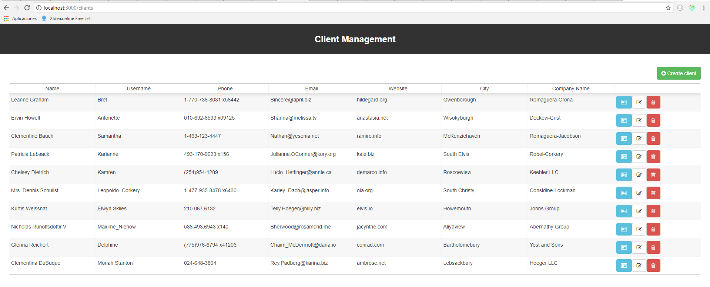
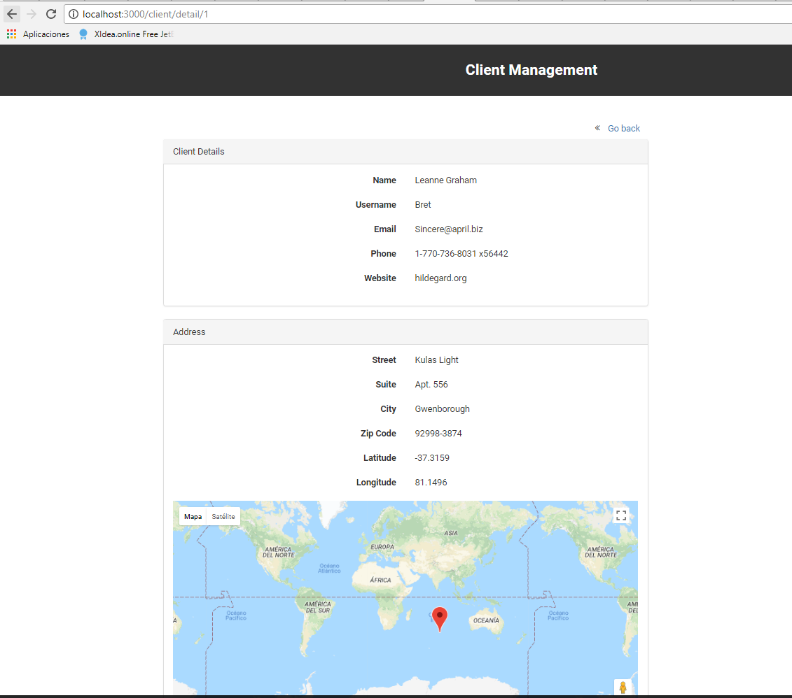
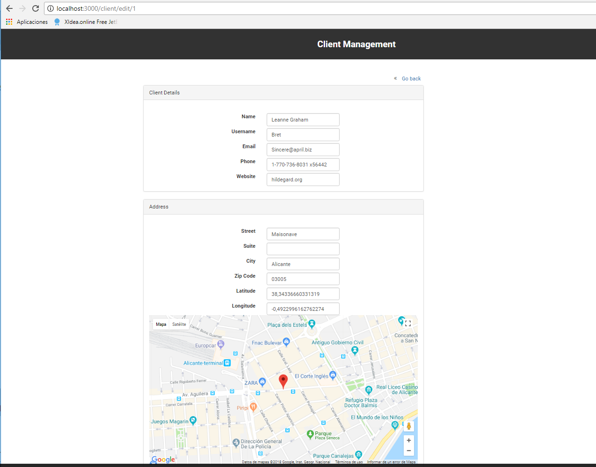
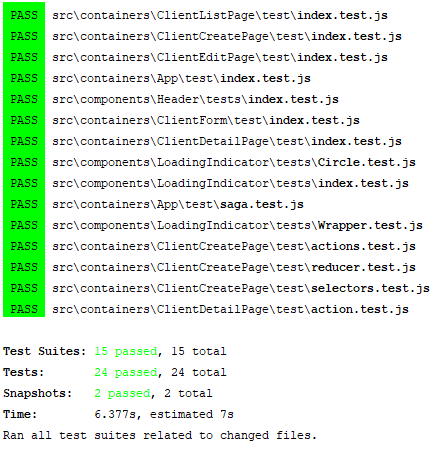
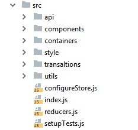

# Client Management React frontend

This project is the frontend of the Client management application implemented with React

### Features

| Feature                                | Summary                                                                                                                                                                                                                                                     |
|----------------------------------------|-------------------------------------------------------------------------------------------------------------------------------------------------------------------------------------------------------------------------------------------------------------|
| ES6 via Babel                  	 	     | ES6 support using Babel.  |
| Reusable components with React                 	 	     | Structure based on components using React - a JavaScript library for building user interfaces  |
| State management via Redux       | Redux is a predictable state container for JavaScript apps. It helps you write applications that behave consistently                     |
| Code Linting via ESlint               			       | JavaScript code linting is done using [ESLint](http://eslint.org) - a pluggable linter tool for identifying and reporting on patterns in JavaScript. Uses ESLint with [eslint-config-airbnb](https://github.com/airbnb/javascript/tree/master/packages/eslint-config-airbnb), which tries to follow the Airbnb JavaScript style guide.                                                                                                |
| Code Coverage via Jest and Enzyme|  Unit Testing and component testing is done using Jest and Enzyme - Jest is a complete and easy to set up JavaScript testing solution. In fact, Jest works out of the box for any React project. - Enzyme is a JavaScript Testing utility for React that makes it easier to assert, manipulate, and traverse your React Components' output.                                                                                                                                                                         |
| Next generation css via styled-component        | Write composable CSS that's co-located with your components for complete modularity. In this app is possible to find some examples of this.                       |
| Easy to manage complex side effects via redux-saga | redux-saga is a library to manage side effects in your application. It works beautifully for data fetching, concurrent computations and a lot more.  |
| Ready to i18n via react-intl | react-intl provides React components and an API to format dates, numbers, and strings, including pluralization and handling translations.|


### Getting Started

Install dependencies:
```sh
npm install

```

Launch development server:
```sh
npm start

```

Navigate to http://localhost:3000/.

The app will automatically reload if you change any of the source files.

The webpackDevServer config (webpackDevServer.config.js file) has been configured to stablish a proxy to the default backend host and port (http://localhost:4040) in order to avoid cross-domain issues during the development.

 ### Screenshots
 
 ##### Client List (initial screen)
   
  
 
 
 ##### Client Detail
   
  
 
 
#####  Client Edit
   

### Tests
```sh
# Run tests 
npm test

```
Jest and Enzyme: 
The application has an example of unit tests using Jest and Enzyme for components, sagas, reducers, actions and selectors:



### Lint
```sh
# Lint code with ESLint
npm run lint
```
The application uses eslint-config-airbnb in order to follow the most of the styles of the Airbnb style guide

### Core Technologies:

 - React
 
 - React Router
 
 - Redux
 
 - Redux Saga
 
 - Reselect
 
 - Styled Components
 
 
### Project structure
 
 
 
 **The structure is based on components**.
 
 We can find two different kind of components. 
 - The presentational ones, which are in components folder. They depends on containers for the data.
 - The container ones, which are connected to the redux store.
 
 **Self-contained components architecture**
 
 This architecture makes easy to reuse component in other projects since all the files are kept in the same folder.
 
 **Redux**
 
 The Redux store is configured in `configureStore.js`. The store is created with `createStore` factory and recives:
 - root reducer
 - initial state
 - middlewares
 
 The middlewares which are used are:
 - redux-saga: to manage side effects, for example asynchronous actions
 - react-router-redux: to sync the routes with the redux store 
 
 **Selectors**
 
 Selectors are function that knows how to extract a specific piece of data from the store. The application uses 
 Reselect library, which have the following features:
 - Computational power
 - Memoization
 - Composability
 
 **Redux-saga**
 
 In the application, it is mainly use to manage the interaction with the back-end. The sagas can be started, paused and cancelled from the main application with normal redux actions, it has access to the full redux application state and it can dispatch redux actions as well.
 
 **Google Maps Javascript API**
 
 To show the localization of the company address is displayed a map using Google Maps Javascript API and react-google-maps library which
 provides a set of React components wrapping the underlying Google Maps JavaScript API v3 instances.
 The coordenates are automatically updates when the user set a marker in the map and viceverse, when 
 the user changes the latitude or longitude input the marker in the map ar updated.
 
